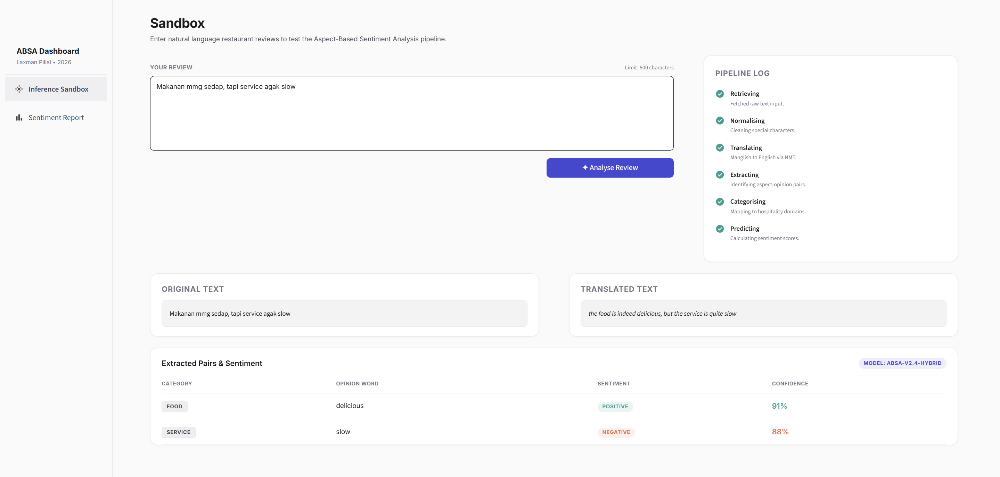
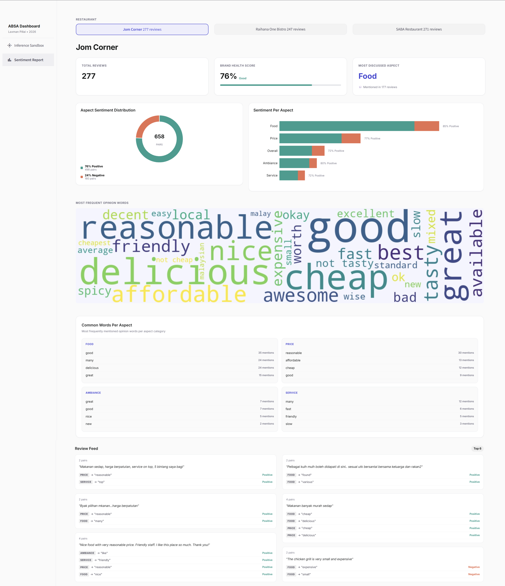

# Hybrid Aspect-Based Sentiment Analysis (ABSA) System for Manglish Restaurant Reviews

A final year project by **Laxman Pillai** (2026) — Multimedia University Cyberjaya  
Supervised by **Zubair Hassan Tarif**

---

## What is this?

This system performs Aspect-Based Sentiment Analysis (ABSA) on Malaysian restaurant reviews written in **Manglish** — a code-switched blend of English and Malay commonly used in online reviews.

Instead of just telling you whether a review is positive or negative overall, the system breaks the review down by **aspect** — food, service, ambiance, price — and tells you the sentiment for each one individually.

The system was evaluated on Google Reviews from three restaurants in Cyberjaya:
- Jom Corner
- Raihana One Bistro
- SABA Restaurant Cyberjaya

---

## How it works

The pipeline runs in five stages:

1. **Normalisation** — Cleans informal Manglish text (slang, repeated characters, abbreviations)
2. **Translation** — Translates Malay/mixed text to English via Google Translate
3. **Aspect Extraction** — Six dependency grammar rules extract aspect-opinion pairs
4. **Categorisation** — Maps extracted aspects to hospitality categories (Food, Service, Ambiance, Price, Overall)
5. **Sentiment Classification** — SVM ensemble classifier predicts positive or negative sentiment per aspect

---

## Key Results

| Metric | Result |
|--------|--------|
| Macro-F1 (SemEval 2014 test set) | 0.8959 |
| Accuracy (SemEval 2014 test set) | 94.2% |
| Extraction rate (Malaysian reviews) | 84.0% |
| Correct extraction rate (after fixes) | 53.7% |
| Malaysian review accuracy | 80.2% (207 judgeable pairs) |

---

## Dashboard

The system includes a two-page interactive Streamlit dashboard:

### Page 1 — Inference Sandbox
Paste any restaurant review (English or Manglish) and get a real-time aspect-sentiment breakdown.



### Page 2 — Sentiment Report
View aggregated sentiment analytics across all three restaurants — brand health score, aspect sentiment distribution, word cloud, and a review feed.



---

## Project Structure

```
├── src/
│   ├── normaliser.py        # Manglish normalisation
│   ├── translator.py        # Google Translate integration
│   ├── extractor.py         # Rule-based aspect extraction
│   ├── categoriser.py       # Aspect categorisation
│   ├── pipeline.py          # End-to-end pipeline
│   └── utils.py             # Utility functions
├── dashboard/
│   ├── app.py               # Streamlit entry point
│   ├── sandbox.py           # Inference Sandbox page
│   ├── sentiment_report.py  # Sentiment Report page
│   └── charts.py            # Chart components
├── data/
│   ├── raw/                 # Raw scraped Google Reviews
│   └── malaysian/           # Malaysian evaluation datasets
├── notebooks/
│   ├── 01_data_pipeline.ipynb
│   ├── 02_eda.ipynb
│   ├── 03_model_training.ipynb
│   └── 04_malaysian_data_pipeline.ipynb
├── screenshots/             # Dashboard screenshots
├── requirements.txt
└── README.md
```

---

## Installation

**Requirements:** Python 3.9+, no GPU needed.

```bash
# Clone the repository
git clone https://github.com/Laxman1104/FYP2-Hybrid-ABSA-System.git
cd FYP2-Hybrid-ABSA-System

# Install dependencies
pip install -r requirements.txt

# Download spaCy model
python -m spacy download en_core_web_md
```

---

## Running the Dashboard

```bash
streamlit run dashboard/app.py
```

The dashboard will open in your browser at `http://localhost:8501`

---

## Running the Pipeline Directly

```python
from src.pipeline import run_pipeline

result = run_pipeline("Makanan sedap tapi service slow", mode="auto")
print(result)
```

---

## Tech Stack

- **spaCy** — Dependency parsing for aspect extraction
- **sentence-transformers** — `paraphrase-multilingual-MiniLM-L12-v2` as frozen feature extractor
- **scikit-learn** — SVM ensemble with soft voting
- **imbalanced-learn** — BorderlineSMOTE for class imbalance
- **Streamlit** — Interactive dashboard
- **Google Translate API** — Manglish to English translation

---

## Dataset

- **Training:** SemEval 2014 Restaurant Dataset (Task 4)
- **Evaluation:** 1,349 Google Reviews scraped from three Cyberjaya restaurants

---

*Multimedia University Cyberjaya — Bachelor of Computer Science (Hons) — 2026*
